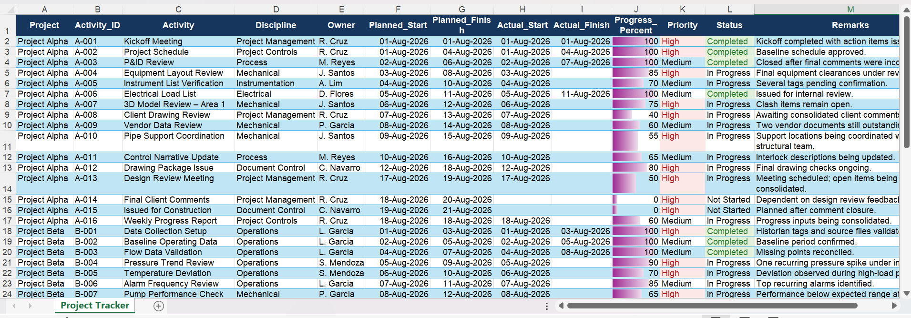
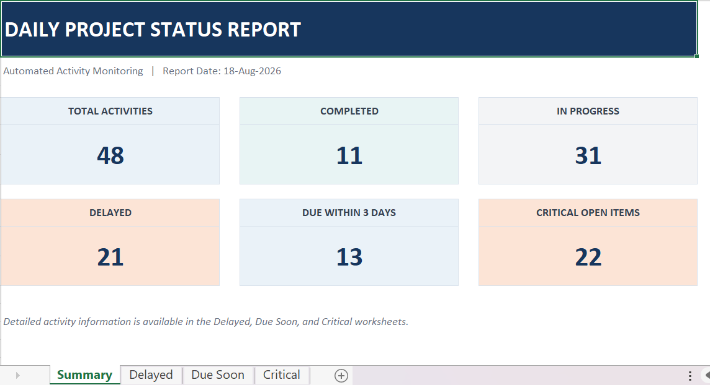
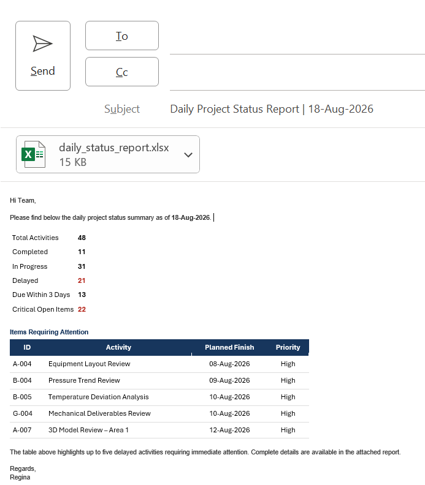

# Automated Daily Status Reporting System

A Python-based reporting automation project designed to analyze project activity data, identify items requiring attention, generate structured status reports, and prepare daily project reporting outputs.

The complete production implementation is maintained privately. This public repository contains a simplified runnable demonstration of the core status-analysis logic together with screenshots of the completed system.

> The full Excel report-generation workflow, Outlook automation, production source code, and implementation details are intentionally not included in this public repository.

---

## Project Overview

Daily project reporting often requires repetitive manual work:

- reviewing activity trackers;
- identifying delayed activities;
- checking upcoming deadlines;
- identifying critical open items;
- preparing summary metrics;
- creating Excel reports; and
- preparing status emails.

This project was developed to automate that workflow using Python.

The complete system processes project tracker data, generates status metrics and detailed activity lists, creates a formatted Excel report, and prepares an Outlook email draft with the generated report attached.

---

## Completed System

The full working version performs the following workflow:

```text
Project Tracker
      ↓
Python Data Processing
      ↓
Status Analysis
      ↓
Delayed / Due Soon / Critical Detection
      ↓
Daily Status Summary
      ↓
Formatted Excel Report
      ↓
Outlook Email Draft
      ↓
Manual Review & Send
```

---

## Status Analysis

The system automatically evaluates project activities and generates key reporting metrics including:

- total activities;
- completed activities;
- activities in progress;
- delayed activities;
- activities due within three days; and
- critical open items.

This reduces the need to manually review individual tracker rows when preparing daily project reports.

---

## Project Tracker



The tracker contains activity-level project information used by the reporting workflow.

The complete project uses Excel-based source data, while the public demonstration uses a small synthetic CSV dataset.

---

## Generated Status Report



The complete system automatically generates a formatted Excel status report containing summary metrics and detailed activity information.

The report is designed to provide a concise view of project status while highlighting items requiring attention.

The Excel report-generation implementation is maintained privately.

---

## Outlook Email Automation



After generating the report, the complete system prepares an Outlook email draft containing the daily project status summary and attaches the generated Excel report.

The email remains in draft form for review before sending.

This provides automation while maintaining a manual approval step before external communication.

The Outlook automation implementation is not included in the public repository.

---

## Runnable Public Demo

A simplified demonstration is included so the core project-status analysis can be independently tested.

The demo uses synthetic project data and demonstrates:

- CSV data loading;
- date-based activity analysis;
- completed and in-progress counts;
- delayed activity detection;
- activities due within three days;
- critical open-item detection; and
- identification of activities requiring attention.

The demo intentionally excludes the complete Excel reporting and Outlook automation implementation.

### Requirements

- Python 3
- pandas

Install the required package:

```bash
pip install -r requirements.txt
```

Run the demonstration:

```bash
python demo/demo_analysis.py
```

Example output:

```text
DAILY PROJECT STATUS - DEMO
==================================
Report Date: 18-Aug-2026

Total Activities       15
Completed              4
In Progress            9
Delayed                7
Due Within 3 Days      4
Critical Open Items    8

ITEMS REQUIRING ATTENTION
==================================
A-004 | Equipment Layout Review | 08-Aug-2026 | High
A-007 | 3D Model Review | 12-Aug-2026 | High
A-008 | Client Drawing Review | 13-Aug-2026 | High
A-010 | Pipe Support Coordination | 15-Aug-2026 | High
A-005 | Instrument List Verification | 10-Aug-2026 | Medium
```

---

## Public Demo Structure

```text
demo/
├── demo_analysis.py
└── sample_data/
    └── project_tracker_demo.csv
```

The demonstration dataset is synthetic and contains no confidential project or company information.

---

## Technologies

The complete project uses:

- Python
- pandas
- Microsoft Excel
- openpyxl
- Outlook automation
- pywin32
- HTML email formatting
- automated report generation

The public demonstration requires only Python and pandas.

---

## Key Features

### Complete Private Implementation

- Excel project tracker processing
- Automated project-status analysis
- Delayed activity identification
- Due-soon activity identification
- Critical open-item detection
- Daily KPI calculation
- Automated formatted Excel report generation
- Detailed activity reporting
- HTML email summary generation
- Outlook draft creation
- Automatic report attachment
- Manual review before email sending

### Public Demonstration

- Synthetic sample dataset
- Runnable Python analysis
- Project-status calculations
- Delayed activity detection
- Due-soon detection
- Critical-item detection
- Attention-item reporting

---

## Repository Approach

This repository is designed as a portfolio case study with a limited runnable demonstration.

The public demo provides enough functionality to review and test the core analytical approach without distributing the complete reusable automation system.

The following components are intentionally maintained privately:

- production Python source code;
- complete Excel report-generation logic;
- Outlook automation code;
- production datasets;
- full workflow implementation; and
- detailed automation logic.

---

## Data Privacy

All publicly available sample data and screenshots are intended for portfolio demonstration.

No confidential company, client, project, or operational data is included in the runnable demonstration.

---

## Author

Regina Grace

Mechanical Engineering • Project Controls • Data & Automation

---

© 2026 Regina Grace. All rights reserved.

This project is provided for portfolio demonstration and professional evaluation purposes. Reuse, redistribution, or commercial use of the complete project materials is not permitted without permission.